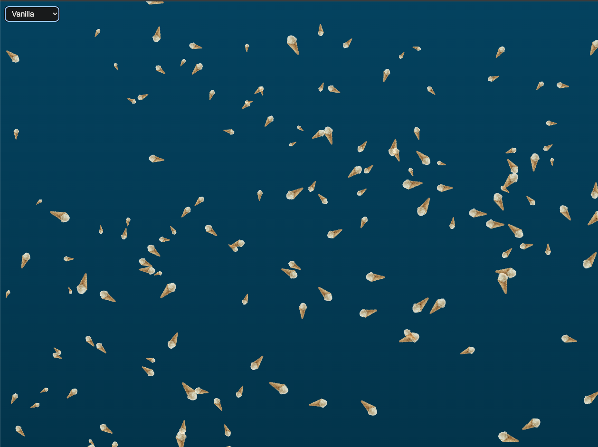

# Vanilla Ice Cream Cone Rain

A visually rich, interactive vanilla ice cream cone rain animation inspired by [corndog.io](https://corndog.io), built with vanilla JavaScript and HTML5 Canvas for smooth performance.

## Features

- Diagonal cone rain flowing from the top-left to bottom-right with a natural sway effect.
- Multiple vanilla ice cream cone flavors: vanilla, chocolate, mint, and rainbow.
- Flavor toggle dropdown to choose a specific cone flavor or randomize cones.
- Realistic depth illusion by scaling cones based on depth.
- Maintains correct aspect ratio for each flavor's unique image shape.
- Uses canvas rendering for smooth, high-performance animation.
- Responsive canvas resizes with the browser window.

## Demo

## Installation

1. Clone or download the repository.

2. Make sure you have the following structure:

    /assets
      ├── vanilla.png
      ├── chocolate.png
      ├── mint.png
      └── rainbow.png
    index.html
    script.js
    style.css
    README.md

3. Open `index.html` in any modern browser.

## Usage

- Use the flavor dropdown in the top-left corner to select a specific cone flavor or randomize.
- Watch the vanilla ice cream cones gently rain diagonally across the screen.
- Resize the browser window to see the animation adapt responsively.

## Development

- `index.html`: Contains the canvas and flavor toggle dropdown.
- `style.css`: Styles for canvas, dropdown, and overall page.
- `script.js`: Core animation logic, image loading, cone creation, and rendering.

## Contributing

Feel free to fork the project and submit pull requests for new features or improvements!

## License

MIT License

---

Built with ❤️ by Henok